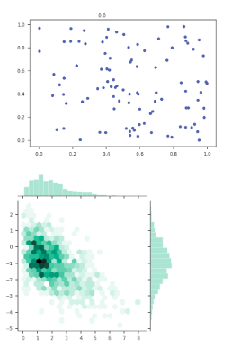

# Generating matplotlib graphs from Flask

Playing around with generating matplotlib graphs dynamically on the server side. The intent is capture a working example of how to get stuff like

onto a web page without having to save generated images to disk. Graphs are converted to HTTP responses (with the right headers, including non-caching) directly.

The hexbin example is adapted from [the seaborn examples](https://seaborn.pydata.org/examples/).

## Getting matplotlib to behave

The key bit to getting matplotlib to play along is

    import matplotlib
    matplotlib.use('agg')

done before any plotting. This prevents matplotlib from trying to use `tkinker`, which ends in tears when looking for bits to serve over HTTP.

## Using this

This particular example is set up be run from a VirtualBox VM built by Vagrant, but that's really incidental. The Python dependencies are in the shell script at the top of `Vagrantfile`. I find VMs (and virtualenvs in them) to be a simple way to muck about with dependencies until they're just right, without risk to polluting my laptop's Python install.
